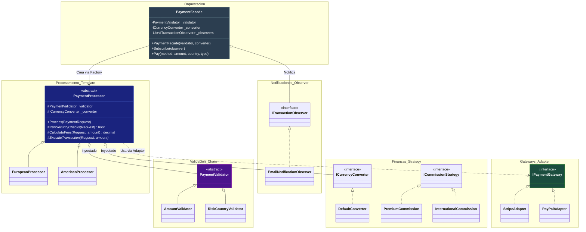

# Diagrama de Clases

```mermaid
classDiagram
    direction TB

    namespace Orquestacion {
        class PaymentFacade {
            -PaymentValidator _validator
            -ICurrencyConverter _converter
            -List~ITransactionObserver~ _observers
            +PaymentFacade(validator, converter)
            +Subscribe(observer)
            +Pay(method, amount, country, type)
        }
    }

    namespace Procesamiento_Template {
        class PaymentProcessor {
            <<abstract>>
            #PaymentValidator _validator
            #ICurrencyConverter _converter
            +Process(PaymentRequest)
            #RunSecurityChecks(Request)* bool
            #CalculateFees(Request, amount) decimal
            #ExecuteTransaction(Request, amount)*
        }
        class EuropeanProcessor
        class AmericanProcessor
    }

    namespace Validacion_Chain {
        class PaymentValidator { <<abstract>> }
        class AmountValidator
        class RiskCountryValidator
    }

    namespace Finanzas_Strategy {
        class ICurrencyConverter { <<interface>> }
        class ICommissionStrategy { <<interface>> }
        class DefaultConverter
        class PremiumCommission
        class InternationalCommission
    }

    namespace Gateways_Adapter {
        class IPaymentGateway { <<interface>> }
        class StripeAdapter
        class PayPalAdapter
    }

    namespace Notificaciones_Observer {
        class ITransactionObserver { <<interface>> }
        class EmailNotificationObserver
    }

    %% Relaciones de Herencia y Realización
    PaymentProcessor <|-- EuropeanProcessor
    PaymentProcessor <|-- AmericanProcessor
    PaymentValidator <|-- AmountValidator
    PaymentValidator <|-- RiskCountryValidator
    ICurrencyConverter <|.. DefaultConverter
    ICommissionStrategy <|.. PremiumCommission
    ICommissionStrategy <|.. InternationalCommission
    IPaymentGateway <|.. StripeAdapter
    IPaymentGateway <|.. PayPalAdapter
    ITransactionObserver <|.. EmailNotificationObserver

    %% Relaciones de Dependencia/Composición
    PaymentFacade o-- ITransactionObserver : Notifica
    PaymentFacade --> PaymentProcessor : Crea via Factory
    PaymentProcessor o-- PaymentValidator : Inyectado
    PaymentProcessor o-- ICurrencyConverter : Inyectado
    PaymentProcessor ..> IPaymentGateway : Usa via Adapter

    %% Estilos
    style PaymentFacade fill:#2c3e50,stroke:#546e7a,color:#fff
    style PaymentProcessor fill:#1a237e,stroke:#3949ab,color:#fff
    style IPaymentGateway fill:#1b4d3e,stroke:#2e7d32,color:#fff
    style PaymentValidator fill:#4a148c,stroke:#7b1fa2,color:#fff
```
