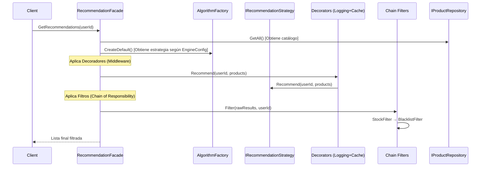

# Diagrama de Arquitectura - Motor de Recomendación

```mermaid
classDiagram
    direction TB

    namespace Configuración_Singleton {
        class EngineConfig {
            -static Lazy~EngineConfig~ _instance
            +static Instance: EngineConfig
            +DefaultStrategy: string
            +SimilarityThreshold: double
            +CacheExpirationInMinutes: int
        }
    }

    namespace Fachada {
        class RecommendationFacade {
            -IProductRepository _repository
            +GetRecommendations(userId) List~Product~
        }
    }

    namespace Estrategia_Algorithm {
        class IRecommendationStrategy {
            <<interface>>
            +Recommend(userId, allProducts) List~Product~
        }
        class CollaborativeFiltering {
            +Recommend(userId, allProducts) List~Product~
        }
        class ContentBasedFiltering {
            +Recommend(userId, allProducts) List~Product~
        }
        class AlgorithmFactory {
            <<static>>
            +CreateDefault() IRecommendationStrategy
        }
    }

    namespace Repositorio {
        class IProductRepository {
            <<interface>>
            +GetAll() List~Product~
        }
        class SqlProductRepository {
            +GetAll() List~Product~
        }
        class Product {
            +int Id
            +string Name
            +string Category
            +bool InStock
        }
    }

    namespace Adaptador_Externo {
        class IExternalPredictor {
            <<interface>>
            +GetExternalPredictions(userId) string[]
        }
        class AmazonMLAdapter {
            -IExternalPredictor _amazonService
            +Recommend(userId, allProducts) List~Product~
        }
    }

    namespace Decoradores {
        class LoggingDecorator {
            -IRecommendationStrategy _inner
            +Recommend(userId, allProducts) List~Product~
        }
        class CacheDecorator {
            -IRecommendationStrategy _inner
            -static Dictionary _cache
            +Recommend(userId, allProducts) List~Product~
        }
    }

    namespace Filtros_Chain {
        class IRecommendationFilter {
            <<interface>>
            +SetNext(next) IRecommendationFilter
            +Filter(products, userId) List~Product~
        }
        class BaseFilter {
            <<abstract>>
            -IRecommendationFilter _next
        }
        class StockFilter {
            +SetNext(next) IRecommendationFilter
            +Filter(products, userId) List~Product~
        }
        class BlacklistFilter {
            +SetNext(next) IRecommendationFilter
            +Filter(products, userId) List~Product~
        }
    }

    %% Relaciones de Configuración Singleton
    EngineConfig --> AlgorithmFactory : Configura estrategia

    %% Relaciones de Fachada
    RecommendationFacade --> IProductRepository : Inyecta
    RecommendationFacade ..> AlgorithmFactory : Obtiene Strategy
    RecommendationFacade ..> IRecommendationFilter : Aplica filtros

    %% Relaciones de Estrategia
    IRecommendationStrategy <|.. CollaborativeFiltering
    IRecommendationStrategy <|.. ContentBasedFiltering
    IRecommendationStrategy <|.. AmazonMLAdapter
    AlgorithmFactory ..> IRecommendationStrategy : Crea

    %% Relaciones de Repositorio
    IProductRepository <|.. SqlProductRepository
    SqlProductRepository ..> Product : Devuelve

    %% Relaciones de Adaptador
    AmazonMLAdapter --> IExternalPredictor : Adapta

    %% Relaciones de Decoración
    IRecommendationStrategy <|.. LoggingDecorator
    IRecommendationStrategy <|.. CacheDecorator
    LoggingDecorator o-- IRecommendationStrategy : Envuelve
    CacheDecorator o-- IRecommendationStrategy : Envuelve

    %% Relaciones de Cadena (Chain of Responsibility)
    IRecommendationFilter <|.. BaseFilter
    BaseFilter <|-- StockFilter
    BaseFilter <|-- BlacklistFilter
    StockFilter --> BlacklistFilter : SetNext()

    %% Estilos
    style EngineConfig fill:#ff6f00,stroke:#e65100,color:#fff
    style RecommendationFacade fill:#1a237e,stroke:#3949ab,color:#fff
    style IRecommendationStrategy fill:#4a148c,stroke:#7b1fa2,color:#fff
    style AlgorithmFactory fill:#00695c,stroke:#00897b,color:#fff
    style IProductRepository fill:#1b4d3e,stroke:#2e7d32,color:#fff
    style IRecommendationFilter fill:#e65100,stroke:#ef6c00,color:#fff
    style IExternalPredictor fill:#b71c1c,stroke:#d32f2f,color:#fff
    style LoggingDecorator fill:#2c3e50,stroke:#546e7a,color:#fff
    style CacheDecorator fill:#2c3e50,stroke:#546e7a,color:#fff
```

## Flujo de Ejecución

## Patrones Implementados

| Patrón | Clase/Interfaz | Propósito |
|--------|----------------|-----------|
| **Singleton** | `EngineConfig` | Configuración global unificada |
| **Factory Method** | `AlgorithmFactory` | Creación de estrategias según configuración |
| **Strategy** | `IRecommendationStrategy` | Algoritmos intercambiables (Collaborative, Content, AmazonML) |
| **Decorator** | `LoggingDecorator`, `CacheDecorator` | Comportamiento adicional (logging, cache) |
| **Chain of Responsibility** | `StockFilter`, `BlacklistFilter` | Encadenamiento de filtros |
| **Repository** | `IProductRepository`, `SqlProductRepository` | Abstracción de acceso a datos |
| **Adapter** | `AmazonMLAdapter` | Integración con servicio externo |
