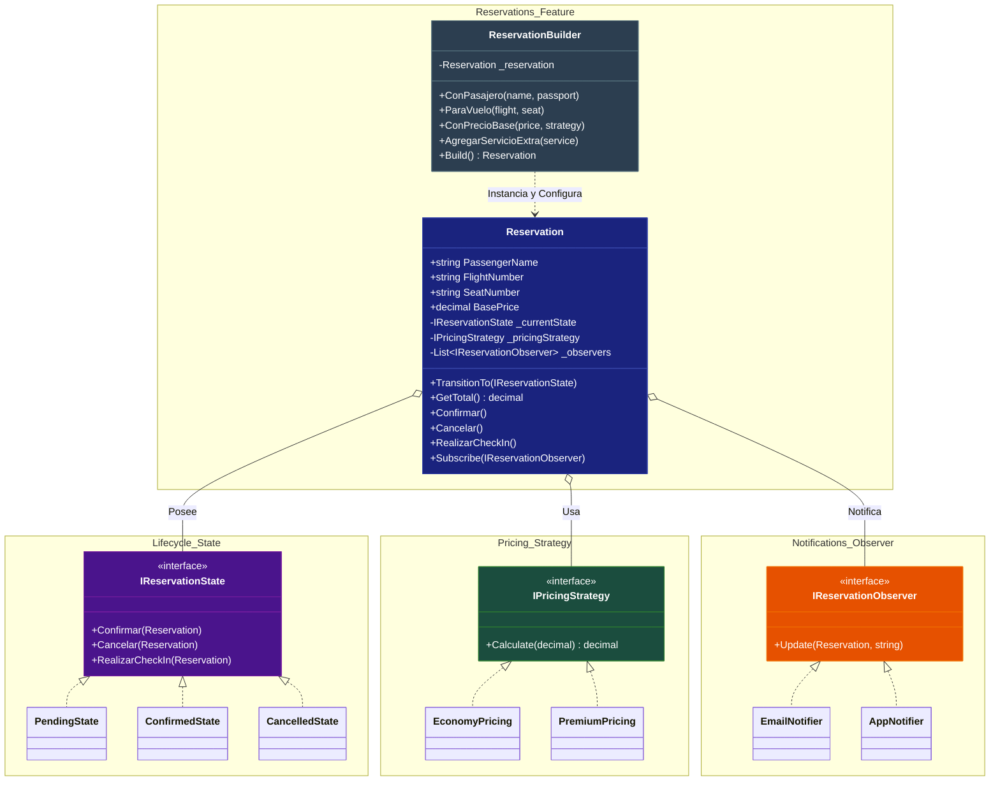

# Diagrama de Clases

```mermaid
classDiagram
    direction TB

    namespace Reservations_Feature {
        class Reservation {
            +string PassengerName
            +string FlightNumber
            +string SeatNumber
            +decimal BasePrice
            -IReservationState _currentState
            -IPricingStrategy _pricingStrategy
            -List~IReservationObserver~ _observers
            +TransitionTo(IReservationState)
            +GetTotal() decimal
            +Confirmar()
            +Cancelar()
            +RealizarCheckIn()
            +Subscribe(IReservationObserver)
        }

        class ReservationBuilder {
            -Reservation _reservation
            +ConPasajero(name, passport)
            +ParaVuelo(flight, seat)
            +ConPrecioBase(price, strategy)
            +AgregarServicioExtra(service)
            +Build() Reservation
        }
    }

    namespace Lifecycle_State {
        class IReservationState {
            <<interface>>
            +Confirmar(Reservation)
            +Cancelar(Reservation)
            +RealizarCheckIn(Reservation)
        }
        class PendingState
        class ConfirmedState
        class CancelledState
    }

    namespace Pricing_Strategy {
        class IPricingStrategy {
            <<interface>>
            +Calculate(decimal) decimal
        }
        class EconomyPricing
        class PremiumPricing
    }

    namespace Notifications_Observer {
        class IReservationObserver {
            <<interface>>
            +Update(Reservation, string)
        }
        class EmailNotifier
        class AppNotifier
    }

    %% Relaciones de Construcción
    ReservationBuilder ..> Reservation : Instancia y Configura

    %% Relaciones de Estado
    Reservation o-- IReservationState : Posee
    IReservationState <|.. PendingState
    IReservationState <|.. ConfirmedState
    IReservationState <|.. CancelledState

    %% Relaciones de Estrategia
    Reservation o-- IPricingStrategy : Usa
    IPricingStrategy <|.. EconomyPricing
    IPricingStrategy <|.. PremiumPricing

    %% Relaciones de Observación
    Reservation o-- IReservationObserver : Notifica
    IReservationObserver <|.. EmailNotifier
    IReservationObserver <|.. AppNotifier

    %% Estilos Profesionales
    style Reservation fill:#1a237e,stroke:#3949ab,color:#fff
    style ReservationBuilder fill:#2c3e50,stroke:#546e7a,color:#fff
    style IReservationState fill:#4a148c,stroke:#7b1fa2,color:#fff
    style IPricingStrategy fill:#1b4d3e,stroke:#2e7d32,color:#fff
    style IReservationObserver fill:#e65100,stroke:#ef6c00,color:#fff
```
