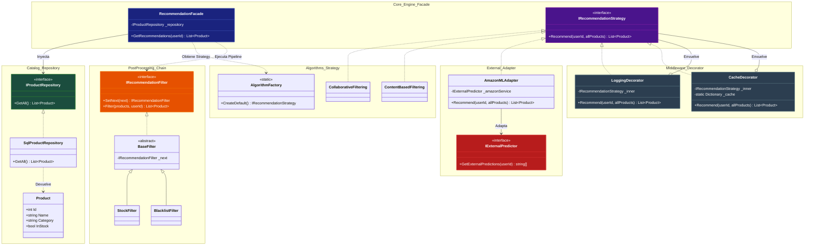

# Diagrama de Clases

```mermaid
classDiagram
    direction TB

    namespace Core_Engine_Facade {
        class RecommendationFacade {
            -IProductRepository _repository
            +GetRecommendations(userId) List~Product~
        }
        class IRecommendationStrategy {
            <<interface>>
            +Recommend(userId, allProducts) List~Product~
        }
    }

    namespace Catalog_Repository {
        class IProductRepository {
            <<interface>>
            +GetAll() List~Product~
        }
        class SqlProductRepository {
            +GetAll() List~Product~
        }
        class Product {
            +int Id
            +string Name
            +string Category
            +bool InStock
        }
    }

    namespace Algorithms_Strategy {
        class AlgorithmFactory {
            <<static>>
            +CreateDefault() IRecommendationStrategy
        }
        class CollaborativeFiltering
        class ContentBasedFiltering
    }

    namespace External_Adapter {
        class IExternalPredictor {
            <<interface>>
            +GetExternalPredictions(userId) string[]
        }
        class AmazonMLAdapter {
            -IExternalPredictor _amazonService
            +Recommend(userId, allProducts) List~Product~
        }
    }

    namespace Middleware_Decorator {
        class LoggingDecorator {
            -IRecommendationStrategy _inner
            +Recommend(userId, allProducts) List~Product~
        }
        class CacheDecorator {
            -IRecommendationStrategy _inner
            -static Dictionary _cache
            +Recommend(userId, allProducts) List~Product~
        }
    }

    namespace PostProcessing_Chain {
        class IRecommendationFilter {
            <<interface>>
            +SetNext(next) IRecommendationFilter
            +Filter(products, userId) List~Product~
        }
        class BaseFilter {
            <<abstract>>
            -IRecommendationFilter _next
        }
        class StockFilter
        class BlacklistFilter
    }

    %% Relaciones de Fachada y Datos
    RecommendationFacade --> IProductRepository : Inyecta
    RecommendationFacade ..> AlgorithmFactory : Obtiene Strategy
    IProductRepository <|.. SqlProductRepository
    SqlProductRepository ..> Product : Devuelve

    %% Relaciones de Estrategia
    IRecommendationStrategy <|.. CollaborativeFiltering
    IRecommendationStrategy <|.. ContentBasedFiltering
    IRecommendationStrategy <|.. AmazonMLAdapter
    AmazonMLAdapter --> IExternalPredictor : Adapta

    %% Relaciones de Decoración
    IRecommendationStrategy <|.. LoggingDecorator
    IRecommendationStrategy <|.. CacheDecorator
    LoggingDecorator o-- IRecommendationStrategy : Envuelve
    CacheDecorator o-- IRecommendationStrategy : Envuelve

    %% Relaciones de Cadena
    IRecommendationFilter <|.. BaseFilter
    BaseFilter <|-- StockFilter
    BaseFilter <|-- BlacklistFilter
    RecommendationFacade ..> IRecommendationFilter : Ejecuta Pipeline

    %% Estilos Profesionales
    style RecommendationFacade fill:#1a237e,stroke:#3949ab,color:#fff
    style IRecommendationStrategy fill:#4a148c,stroke:#7b1fa2,color:#fff
    style IProductRepository fill:#1b4d3e,stroke:#2e7d32,color:#fff
    style IRecommendationFilter fill:#e65100,stroke:#ef6c00,color:#fff
    style IExternalPredictor fill:#b71c1c,stroke:#d32f2f,color:#fff
    style LoggingDecorator fill:#2c3e50,stroke:#546e7a,color:#fff
    style CacheDecorator fill:#2c3e50,stroke:#546e7a,color:#fff
```
