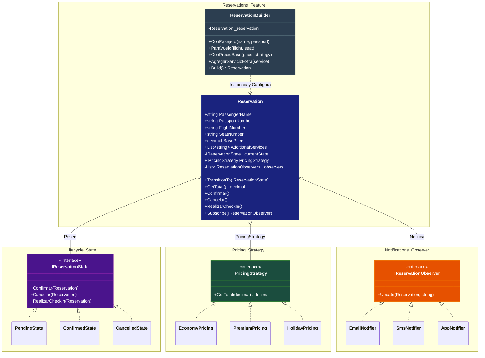

# Arquitectura del Sistema de Reservas de Aerolínea

## Diagrama de Clases



---

## Patrones de Diseño Implementados

### 1. Builder Pattern - ReservationBuilder

**Ubicación:** `Reservations/ReservationBuilder.cs`

**Propósito:** Construir objetos `Reservation` complejos paso a paso sin constructores telescópicos.

**Implementación:**
- `ReservationBuilder` permite encadenar métodos fluent:
  - `ConPasejero(string nombre, string pasaporte)` - Define el pasajero
  - `ParaVuelo(string numeroVuelo, string asiento)` - Define el vuelo y asiento
  - `ConPrecioBase(decimal precio, IPricingStrategy estrategia)` - Define precio y estrategia
  - `AgregarServicioExtra(string servicio)` - Agrega servicios adicionales
- Valida reglas de negocio en `Build()` antes de retornar la reserva
- El builder es reutilizable (crea nueva instancia después de cada Build)

**Validaciones del Builder:**
- No se puede construir una reserva sin pasajero
- Toda reserva debe tener una estrategia de precio definida

---

### 2. Strategy Pattern - IPricingStrategy

**Ubicación:** 
- Interfaz: `Reservations/Pricing/Interfaces/IPricingStrategy.cs`
- Implementaciones: `Reservations/Pricing/EconomyPricing.cs`, `Reservations/Pricing/HolidayPricing.cs`

**Propósito:** Encapsular diferentes algoritmos de cálculo de precios permitiendo selección dinámica en tiempo de ejecución.

**Implementación:**
- Interfaz `IPricingStrategy` define el contrato `GetTotal(decimal basePrice)`
- Estrategias disponibles:
  - `EconomyPricing` - Precio clase económica
  - `PremiumPricing` - Precio clase premium
  - `HolidayPricing` - Precio temporada alta
- Cada reserva tiene una propiedad `PricingStrategy` que calcula el total

---

### 3. State Pattern - IReservationState

**Ubicación:**
- Interfaz: `Reservations/LifeCycle/Interfaces/IReservationState.cs`
- Estados: `Reservations/LifeCycle/PendingState.cs`, `ConfirmedState.cs`, `CancelledState.cs`

**Propósito:** Modelar el comportamiento específico de cada estado de la reserva, permitiendo cambiar el comportamiento dinámicamente.

**Implementación:**
- Interfaz `IReservationState` define métodos: `Confirmar`, `Cancelar`, `RealizarCheckIn`
- Estados concretos:
  - `PendingState` - Estado inicial, permite confirmar o cancelar
  - `ConfirmedState` - Reserva confirmada, permite check-in
  - `CancelledState` - Reserva cancelada, estado terminal
- La clase `Reservation` mantiene una referencia al estado actual y delega comportamiento

---

### 4. Observer Pattern - IReservationObserver

**Ubicación:**
- Interfaz: `Reservations/Notifications/Interfaces/IReservationObserver.cs`
- Implementaciones: `Reservations/Notifications/EmailNotifier.cs`, `SmsNotifier.cs`

**Propósito:** Desacoplar la lógica de la reserva de los mecanismos de notificación, permitiendo múltiples observadores.

**Implementación:**
- Interfaz `IReservationObserver` define el método `Update(Reservation reservation, string message)`
- Observadores concretos:
  - `EmailNotifier` - Notifica por correo electrónico
  - `SmsNotifier` - Notifica por SMS
  - `AppNotifier` - Notifica en la aplicación
- La reserva mantiene una lista de observadores y notifica cambios de estado automáticamente

---

## Estructura del Proyecto

```
ReservasAerolinea/
├── Reservations/
│   ├── Reservation.cs                 # Clase principal de la reserva
│   ├── ReservationBuilder.cs          # Constructor de reservas (Builder)
│   ├── Pricing/
│   │   ├── Interfaces/
│   │   │   └── IPricingStrategy.cs    # Interfaz Strategy
│   │   ├── EconomyPricing.cs          # Estrategia precio económica
│   │   └── HolidayPricing.cs          # Estrategia precio temporada alta
│   ├── LifeCycle/
│   │   ├── Interfaces/
│   │   │   └── IReservationState.cs   # Interfaz State
│   │   ├── PendingState.cs            # Estado pendiente
│   │   ├── ConfirmedState.cs          # Estado confirmada
│   │   └── CancelledState.cs          # Estado cancelada
│   └── Notifications/
│       ├── Interfaces/
│       │   └── IReservationObserver.cs # Interfaz Observer
│       ├── EmailNotifier.cs            # Notificador email
│       └── SmsNotifier.cs              # Notificador SMS
└── Program.cs                         # Punto de entrada
```

---

## Flujo de Uso Típico

1. **Construcción:** Se usa `ReservationBuilder` para crear una reserva
2. **Suscripción:** Se registran observadores (Email, SMS) para recibir notificaciones
3. **Confirmación:** Se llama `Confirmar()` que cambia el estado a `ConfirmedState`
4. **Cálculo:** Se usa `GetTotal()` para obtener el precio final según la estrategia
5. **Check-in:** Solo disponible desde estado confirmado

---

## Resumen de Patrones

| Patrón | Interfaz/Clase Base | Implementaciones |
|--------|---------------------|------------------|
| **Builder** | `ReservationBuilder` | - |
| **Strategy** | `IPricingStrategy` | `EconomyPricing`, `PremiumPricing`, `HolidayPricing` |
| **State** | `IReservationState` | `PendingState`, `ConfirmedState`, `CancelledState` |
| **Observer** | `IReservationObserver` | `EmailNotifier`, `SmsNotifier`, `AppNotifier` |
